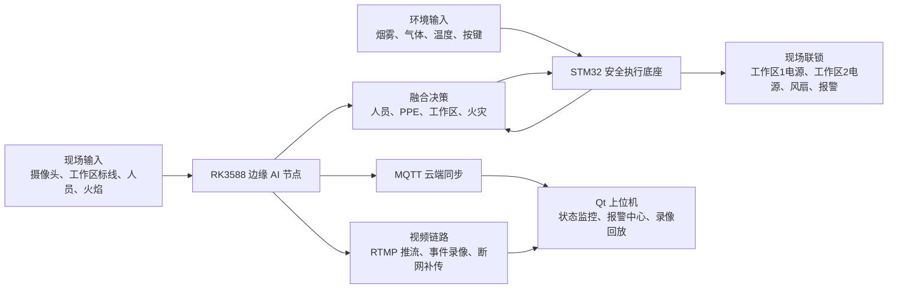

# 基于 RK3588 的多模态智能安全联锁系统

本仓库用于归档和展示比赛项目代码，包含 RK3588 边缘智能端、Qt 上位机端和 STM32 下位机安全执行端三部分。

项目面向危化品库区、临时动火检修、设备维护等高风险作业场景，针对传统工业安防系统“只能报警、不能主动干预”的问题，设计并实现了一套集视觉识别、环境检测、语音报警、设备联锁、事件录像和云端追溯于一体的智能安全联锁平台。

## 项目简介

系统采用“边缘智能识别 + 下位机安全联锁”的双层架构：

- RK3588 作为边缘 AI 计算节点，负责摄像头视频采集、RKNN 目标检测、双工作区识别、人员/PPE/火焰检测、融合决策、RTMP 推流、事件录像、断网补传和 MQTT 状态同步。
- STM32 作为安全执行底座，负责环境传感、按键复位、工作区电源控制、风扇控制和异常情况下的安全兜底。
- Qt 上位机作为监控与展示平台，负责集中显示设备状态、报警信息、火灾置信度曲线、视频预览和历史录像回放。

系统通过 RK3588 与 STM32 串口通信，将 AI 视觉结果与下位机环境信息进行融合判断，实现“发现风险、判断风险、执行联锁、录像追溯”的完整闭环。

## 代码来源

本仓库中的代码按比赛提交需求重新整理为三个独立目录：

| 目录 | 内容 | 来源 |
| --- | --- | --- |
| `rk3588/` | RK3588 边缘端程序 | 来自 `12445615/rk` 的 `backup-20260626-rk3588` 备份点，对应提交 `b22cd97` |
| `qt/` | Qt 上位机程序 | 来自 `12445615/qt` 的 `backup-20260626-qt` 备份点，对应提交 `2c26b35` |
| `stm32/` | STM32 下位机工程 | 来自本地 STM32 工程 `E:\Linux\airk3588_ai\rk` |

## 仓库结构

```text
qiansai/
├── rk3588/      # RK3588 边缘智能端：AI 推理、视频处理、MQTT、串口联锁
├── qt/          # Qt 上位机：状态监控、报警中心、录像回放、曲线展示
├── stm32/       # STM32 下位机：传感器采集、按键、继电器、风扇、安全联锁
├── .gitignore
└── README.md
```

## 总体架构



系统将现场视频、环境传感、人员状态和执行机构状态统一纳入闭环控制。RK3588 负责高算力 AI 识别和综合判断，STM32 负责底层实时控制与故障保护，Qt 上位机负责可视化监控和事件追溯。

## RK3588 边缘智能端

RK3588 端是系统的边缘智能核心，主要功能包括：

- V4L2 摄像头采集，支持 1280×720@30FPS 视频输入。
- 基于 RKNN 的目标检测，识别人员、防护服、安全帽、火焰等目标。
- 双红色工作区动态识别，将地面两个红色框作为工作区 1 和工作区 2。
- 基于人员检测框底边位置判断人员所属工作区。
- 工作区人数统计，实现单人准入、多人人员干扰判断。
- PPE 准入核验，区内 PPE 异常触发对应工作区断电，区外 PPE 异常只告警不影响电源。
- 火灾视觉检测，并结合 STM32 环境异常信号进行火灾融合确认。
- H.264 硬件编码与 RTMP 推流，实现实时视频上墙。
- 事件录像分片保存，支持断网缓存和网络恢复后自动补传。
- MQTT 状态上报，包括报警状态、电源状态、火灾置信度、STM32 在线状态等。
- 串口安全通信，将融合决策结果下发给 STM32 执行联锁。

## STM32 下位机安全执行端

STM32 端作为安全底座，保证系统在上位机异常或通信异常时仍能进入安全状态。主要功能包括：

- 采集环境传感器数据，如烟雾、气体、温度等。
- 采集复位按键和测试按键状态。
- 控制工作区 1 电源、工作区 2 电源、风扇和报警输出。
- 接收 RK3588 下发的联锁指令，并执行对应动作。
- 在 RK3588 离线、串口异常或通信超时时关闭执行机构，进入保护状态。
- 支持 PA5 复位流程，用于解除已确认恢复安全的联锁状态。

下位机不只承担“执行命令”的角色，还负责安全兜底。这样即使边缘端程序异常、网络中断或上位机不在线，现场执行机构也不会继续保持危险状态。

## Qt 上位机监控端

Qt 上位机用于比赛演示和现场集中监控，主要功能包括：

- 实时显示设备运行状态。
- 显示工作区 1、工作区 2 电源状态。
- 显示风扇、报警、STM32 在线状态等联锁信息。
- 接收 MQTT 数据并更新报警中心。
- 绘制火灾置信度曲线，辅助观察 AI 识别变化。
- 展示最近报警记录。
- 支持实时视频预览和历史录像回放。
- 支持回放进度条和倍速播放等操作。

Qt 端相当于系统的“监控上位机”，用于把边缘端和下位机的状态以更直观的方式呈现出来。

## 核心联锁逻辑

### 1. 双工作区准入

系统将地面两个红色框识别为两个独立工作区：

- 左侧为工作区 1，对应 STM32 的 PA1 电源控制。
- 右侧为工作区 2，对应 STM32 的 PA7 电源控制。

人员所属区域通过人体检测框最底边位置判断。这样比单纯使用检测框中心点更符合实际站立位置，也更适合俯拍场景。

### 2. 正常作业状态

- 工作区无人时，对应工作区电源默认关闭。
- 工作区出现 1 名人员，且 PPE 检测通过时，对应工作区电源开启。
- 正常作业时风扇保持开启。

### 3. 人员干扰状态

- 工作区 1 出现 2 人及以上时，关闭工作区 1 电源并触发报警。
- 工作区 2 出现 2 人及以上时，关闭工作区 2 电源并触发报警。
- 多人干扰解除后，系统延时确认，避免人员短暂遮挡或检测抖动造成频繁通断。

### 4. PPE 异常状态

- 如果 PPE 异常人员位于工作区内，关闭对应工作区电源并语音提醒。
- 如果 PPE 异常人员位于工作区外，只进行语音提醒和状态上报，不关闭工作区电源。

### 5. 火灾融合判定

系统不是单纯依赖视觉火焰框直接触发火灾联锁，而是采用视觉与环境共同确认的思路：

- RK3588 识别到火焰后上传火灾置信度，并进入重点监测状态。
- 当视觉火焰与温度、烟雾、气体等环境异常共同满足条件时，确认火灾。
- 火灾确认后，关闭两个工作区电源，关闭风扇，进入全局联锁报警状态。

这种策略可以降低单一视觉误检带来的误停机风险，同时保留火灾场景下的强制断电能力。

### 6. 通信异常保护

- RK3588 离线或串口通信异常时，STM32 关闭工作区电源和风扇。
- MQTT 或网络异常时，RK3588 继续本地推理和本地录像。
- 网络恢复后，录像文件通过上传线程自动补传，实现断网期间事件可追溯。

## 主要功能

| 功能模块 | 功能说明 |
| --- | --- |
| AI 目标检测 | 识别人员、防护服、安全帽、火焰等目标 |
| 双工作区识别 | 动态识别地面两个红色工作区 |
| PPE 准入 | 判断人员防护装备是否符合要求 |
| 人员干扰检测 | 判断单个工作区内是否出现多人干扰 |
| 火灾融合检测 | 结合视觉火焰与环境异常确认火灾 |
| 分区电源联锁 | 工作区 1、工作区 2 独立断电控制 |
| 语音报警 | 针对火灾、PPE 异常、人员干扰进行提示 |
| 事件录像 | 识别到风险事件后保留录像片段 |
| 断网补传 | 网络恢复后自动上传本地缓存录像 |
| MQTT 同步 | 将设备状态、报警状态、火灾置信度同步到云端 |
| Qt 上位机 | 集中展示状态、曲线、报警和录像 |

## 技术特点

1. 边缘 AI 决策  
   RK3588 在本地完成视频采集、AI 推理和联锁判断，不依赖云端返回结果，降低延迟并提升现场自治能力。

2. AI 与安全执行解耦  
   RK3588 负责复杂识别和策略判断，STM32 负责实时执行与安全兜底，避免单点异常导致现场失控。

3. 分区联锁控制  
   两个工作区独立判断、独立断电，既能保证安全，也减少对正常作业区域的影响。

4. 多模态融合火灾判定  
   火焰视觉识别与环境传感信息共同参与火灾确认，提升火灾报警可靠性。

5. 视频追溯闭环  
   系统不仅能实时报警和断电，还能保留事件录像，并在断网恢复后自动补传，便于后续复盘。

## 比赛演示建议流程

建议按以下顺序展示系统功能：

1. 展示系统整体结构  
   说明 RK3588、STM32、Qt 上位机、摄像头、工作区电源和风扇之间的关系。

2. 展示双工作区识别  
   摄像头识别地面两个红色工作区，Qt 上位机显示当前状态。

3. 展示单人准入上电  
   一名 PPE 合规人员进入工作区，对应工作区电源开启。

4. 展示多人干扰断电  
   同一工作区出现两人，对应工作区电源关闭并触发报警。

5. 展示 PPE 异常处理  
   工作区内 PPE 不合规时对应工作区断电；工作区外 PPE 不合规时只报警不切断电源。

6. 展示火灾融合报警  
   视觉检测到火焰并结合环境异常后，系统关闭两路工作区电源和风扇，进入火灾联锁状态。

7. 展示 RK3588 离线保护  
   模拟 RK3588 离线或串口异常，STM32 自动关闭执行机构。

8. 展示事件录像和回放  
   在 Qt 上位机查看报警记录、火灾置信度曲线和事件录像回放。

## 部署说明

### RK3588 端

RK3588 端代码位于 `rk3588/`，部署时需要根据现场环境配置：

- RKNN 模型路径。
- 摄像头设备节点。
- STM32 串口设备，如 `/dev/ttyS9`。
- MQTT 产品信息、设备信息和 topic。
- RTMP 推流地址。
- 视频上传服务器地址和端口。
- 本地录像保存目录。
- 语音报警音频文件和音频守护脚本。

### Qt 上位机端

Qt 端代码位于 `qt/`，主要依赖：

- Qt Widgets。
- Qt MQTT。
- Qt Charts。
- Qt Multimedia 或对应视频播放组件。

部署时需要保证 MQTT topic、视频流地址、录像服务器地址与 RK3588 端配置一致。

### STM32 端

STM32 工程位于 `stm32/`，主要包含：

- GPIO 按键与执行机构控制。
- 串口通信协议。
- 环境传感器采集。
- 工作区电源与风扇联锁逻辑。
- RK3588 离线保护逻辑。

烧录前需要确认实际硬件引脚与工程配置一致，尤其是工作区电源、风扇、复位按键和串口引脚。

## 适用场景

- 危化品库区临时动火作业。
- 工业设备检修和维护。
- 有明火、电气设备和可燃气体风险的作业现场。
- 需要视频监控、人员准入、安全联锁和事件追溯的嵌入式工业安全场景。

## 项目价值

本项目的核心价值在于将“看得见”的 AI 视觉识别和“管得住”的硬件联锁结合起来。系统不仅能识别人员违规、PPE 异常、多人干扰和火灾风险，还能直接控制现场电源与排风设备，实现从风险发现到主动干预的闭环安全控制。

相比传统视频监控，本系统更强调边缘侧实时自治、下位机安全兜底和事故过程可追溯，适合作为工业特种作业安全监控与联锁控制的原型系统。
